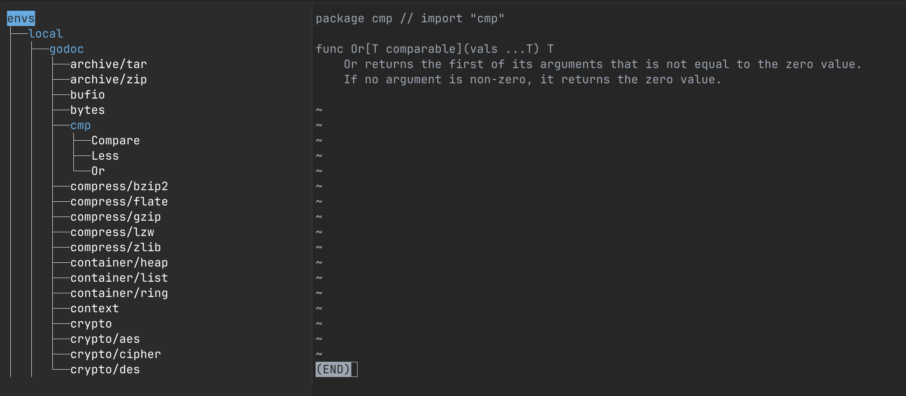

# fe



Fuzzy Explorer is your ultimate terminal companion for navigating logs, configurations, Kafka topics, and more.

If there is one tool I would recommend to every sysadmin, DevOps engineer, or anyone who lives in a terminal, it's [fzf](https://github.com/junegunn/fzf). I use it for nearly everything: searching and taking action on the results. Here are some examples of what you can do:

- Search with `brew search` then install with `brew install`
- Find processes with `ps -ef | grep` then terminal with `kill`
- Open a recent Jira issue in your web browser
- Launch your project in your favorite editor
- Copy a password from KeepassXC to the clipboard
- Retrieve secrets from Vault
- Query Kafka topics
- Quickly view Sentry issues
- Tail logs using [lnav](https://lnav.org/)
- ...

However, there are situations where you might want it to stay open after making selection, such as when commands take time to generate a list of options:

- https://github.com/junegunn/fzf/issues/2213
- https://github.com/junegunn/fzf.vim/issues/192 

Fuzzy Explorer solves this problem by keeping the tree open, allowing you to seamlessly explorer and act on hierarchical data.

## Requirements

- [WezTerm](https://wezfurlong.org/wezterm/index.html)

## Installation

### Install via homebrew

```
$ brew install quantonganh/tap/fe
```

### Install via go

```
go install github.com/quantonganh/fe@latest
```

## Usage

First, create a configuration file to define your exploration hierarchy:

```yaml
terminal: wezterm

root:
  name: envs
  children:
    - name: local
      children:
        - name: godoc
          children:
            - command: >
                go list std
              children:
                - command: go doc -short $current | grep '^[ ]*func' | sed -E 's/^[ ]*func ([^[(]+).*/\1/'
                  children:
                  - finalCommand: go doc $parent.$current | less
```

Run the program with your configuration:

```sh
fe -c /path/to/config.yaml
```

With Fuzzy Explorer, you can quickly navigate complex data structure, perform contextual actions, and stay in control of your workflow.
